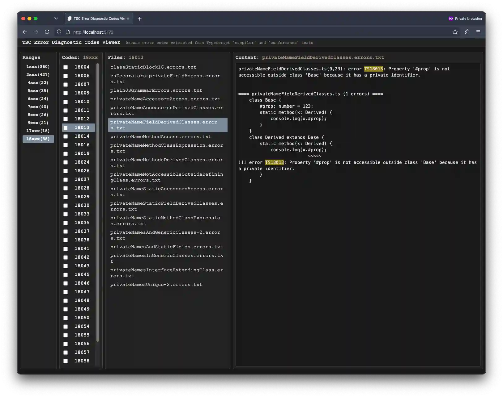

# tsc-diagnostics_error_codes-viewer



## Development

```sh
npm i

DEBUG=1 TS_REPO_DIR=../TypeScript OUTPUT_DIR=./src/lib node --experimental-strip-types init.ts

TS_REPO_DIR=../TypeScript npm run dev
```
